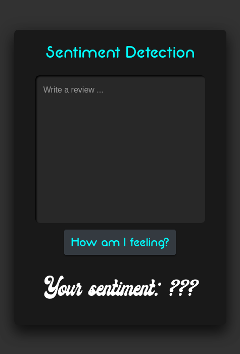
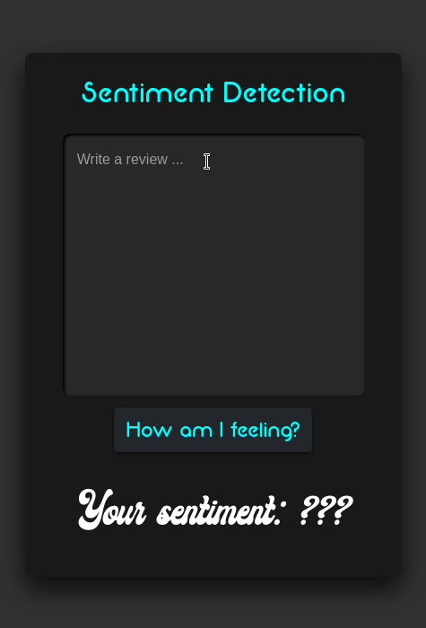

<b> Sentiment Detection </b>
-
A simple machine learning website that detects user sentiment from a review. The examples shown are very short reviews, but the application can detect the general feeling of a message with over 200 characters.

The application has a testing accuracy of 90%. It is validated using nested cross-validation, and uses a neural network behind the scenes. Coded from scratch in a few hours.

  

  

  

  
  